# F Prime Ref Topology
| 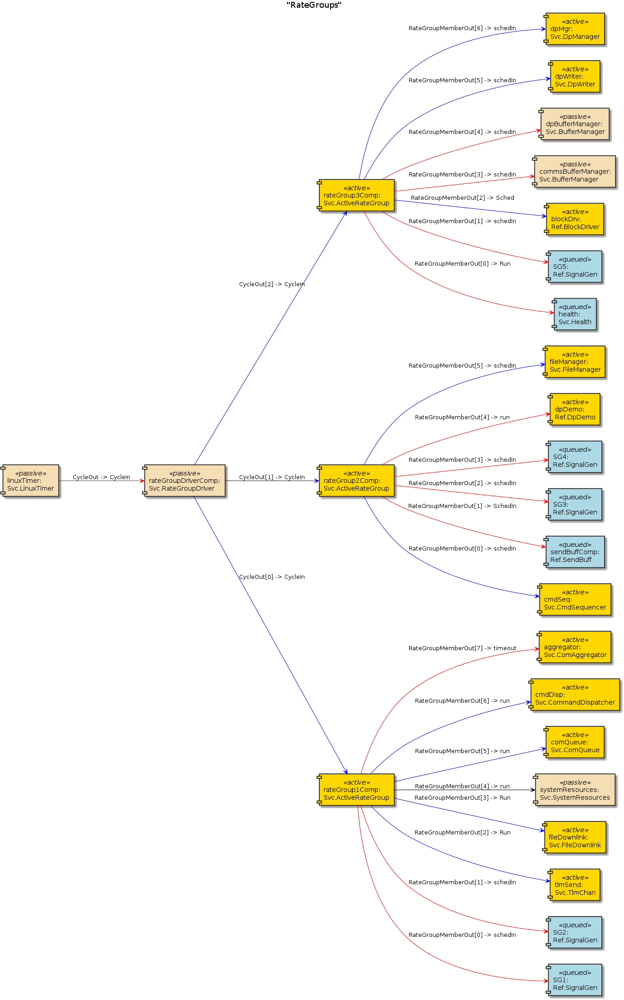 |
|---------------------------------------------|

| 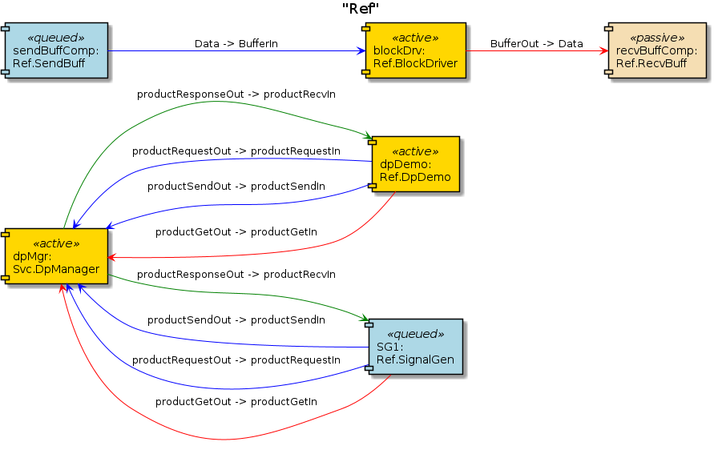 |
|---------------------------------------------|

| 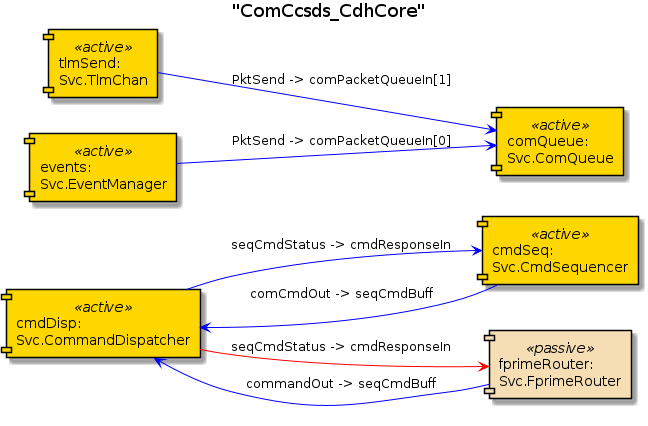 |
|---------------------------------------------|

| 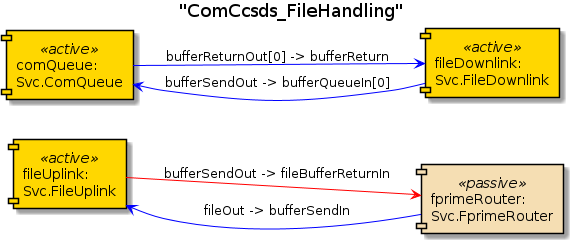 |
|---------------------------------------------|

| 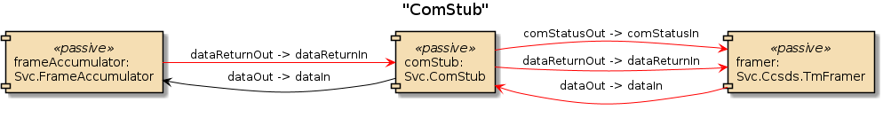 |
|---------------------------------------------|

| 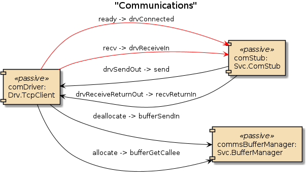 |
|---------------------------------------------|

| 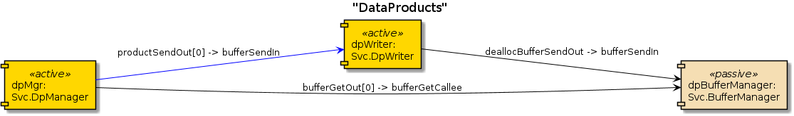 |
|---------------------------------------------|

| 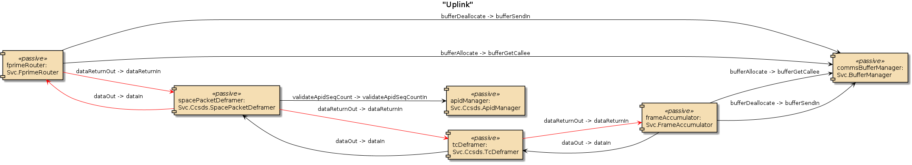 |
|---------------------------------------------|

| 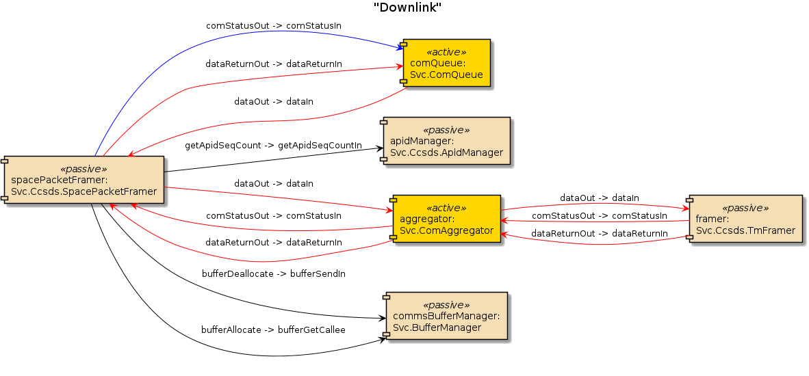 |
|---------------------------------------------|

| 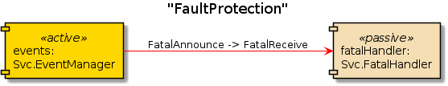 |
|---------------------------------------------|

| 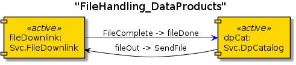 |
|---------------------------------------------|

| 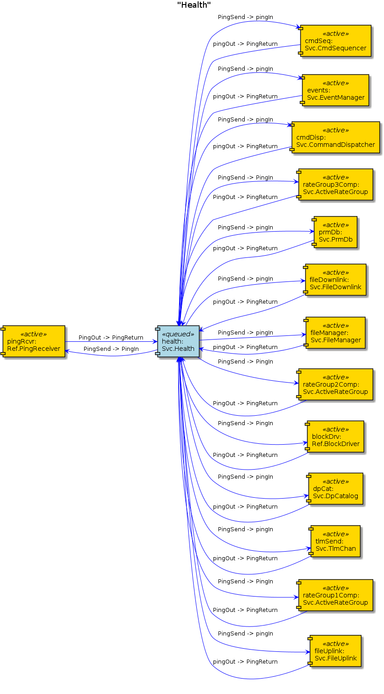 |
|---------------------------------------------|

| 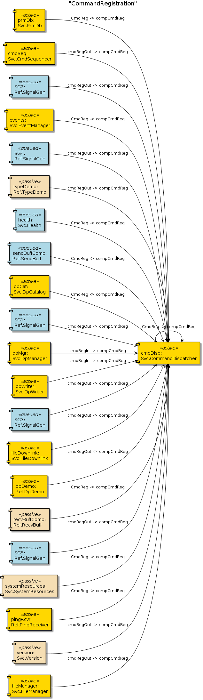 |
|---------------------------------------------|

| 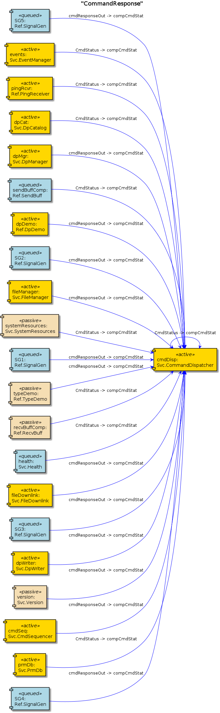 |
|---------------------------------------------|

| 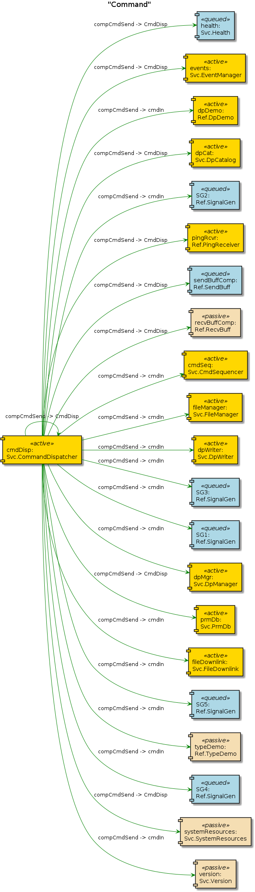 |
|---------------------------------------------|

| 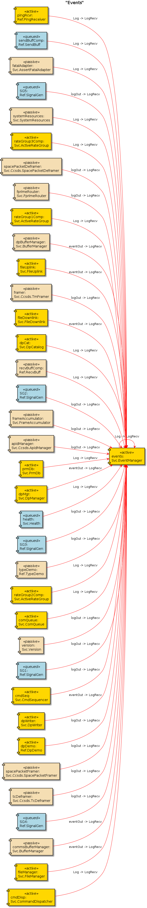 |
|---------------------------------------------|

| 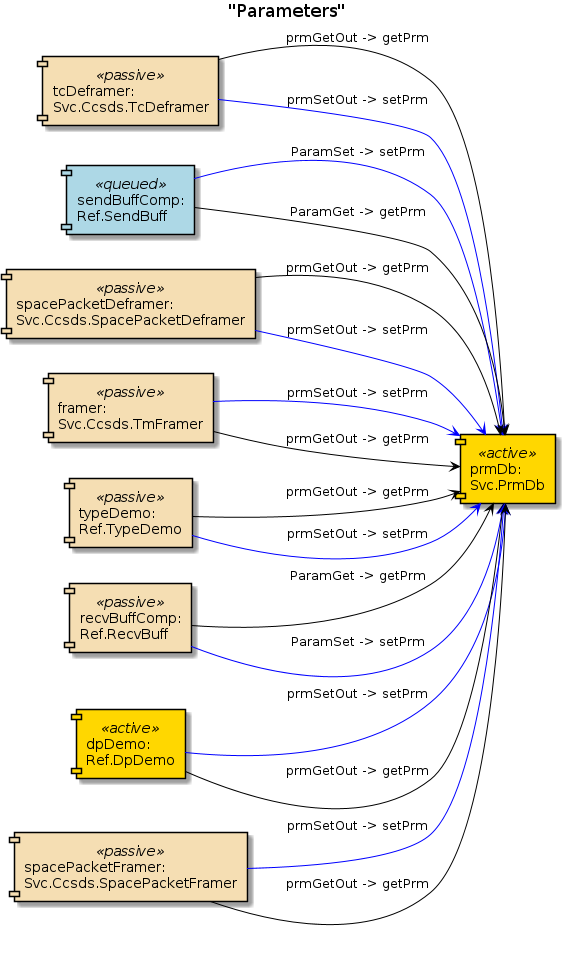 |
|---------------------------------------------|

| 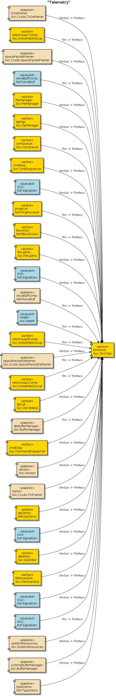 |
|---------------------------------------------|

| 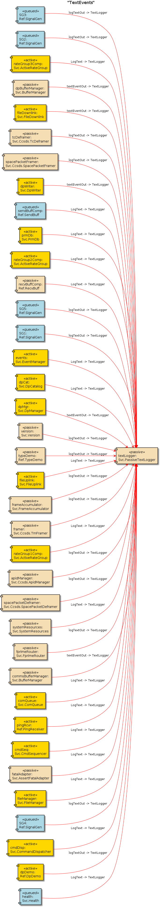 |
|---------------------------------------------|

| 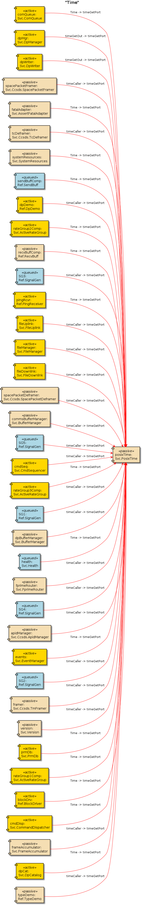 |
|---------------------------------------------|
